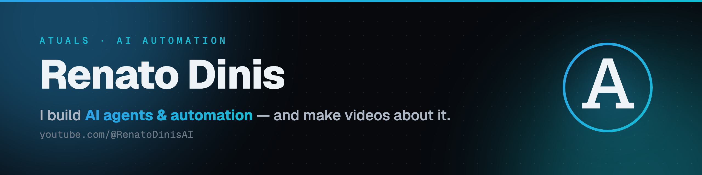

  

<h1 align="center">Hey, I'm Renato 👋</h1>

  I teach people to <b>build with AI</b> on <a href="https://www.youtube.com/@RenatoDinisAI"><b>YouTube</b></a>,
  and build it for clients at <a href="https://atuals.com/"><b>Atuals</b></a>.
   
   based in <b>Coimbra, Portugal</b> &nbsp;·&nbsp;
   born in <b>Luxembourg</b>

  
  
  
  
  
  

<h3 align="center">🛠️ What I teach and build with</h3>

  
  
  
  
  
  
   
  
  
  
  

<h3 align="center">⭐ Featured</h3>
<table>
  <tr>
    <td align="center" width="50%">
      
       
      <b>YouTube</b> — step-by-step builds: Claude Code, AI agents, n8n. Learn to build, free.
    </td>
    <td align="center" width="50%">
      
       
      <b>Atuals</b> — my AI agency. Custom AI agents and automation, built for you.
    </td>
  </tr>
</table>

<h3 align="center">🎓 Learn to build — pick a track</h3>

  New here? Start with my best builds across every topic.
   
  

<table>
  <tr>
    <td align="center" width="20%">
      
       
      <b>n8n Automation</b>
    </td>
    <td align="center" width="20%">
      
       
      <b>Claude Code</b>
    </td>
    <td align="center" width="20%">
      
       
      <b>Local AI</b>
    </td>
    <td align="center" width="20%">
      
       
      <b>AI Video</b>
    </td>
    <td align="center" width="20%">
      
       
      <b>Content Creators</b>
    </td>
  </tr>
</table>

<h3 align="center">📺 Latest from YouTube</h3>
<table>
  <tr>
    <td align="center" width="25%">
      
       
      <b>I Built a Carousel System with One Screenshot</b>
    </td>
    <td align="center" width="25%">
      
       
      <b>Headroom Has 47K Stars (Does It Work?)</b>
    </td>
    <td align="center" width="25%">
      
       
      <b>Ponytail Isn&#39;t Cheaper (I Tested It)</b>
    </td>
    <td align="center" width="25%">
      
       
      <b>Fable 5: Banned 4 Days After Launch</b>
    </td>
  </tr>
</table>

<h3 align="center">✍️ Latest from the Atuals blog</h3>

  <a href="https://atuals.com/blog/make-viral-carousels-with-claude-code" target="_blank"><b>How I Use Claude Code to Make Viral Carousels</b></a> · 26 Jun 2026 
  <a href="https://atuals.com/blog/i-tested-headroom" target="_blank"><b>I Tested Headroom: Where the 95% Token Savings Is Real (And Where It Isn&#39;t)</b></a> · 23 Jun 2026 
  <a href="https://atuals.com/blog/i-tested-ponytail" target="_blank"><b>I Tested Ponytail: When It Helps And When It Doesn&#39;t</b></a> · 19 Jun 2026 
  <a href="https://atuals.com/blog" target="_blank">all posts →</a>

  🤝 Learning to build with AI?
  <a href="https://atuals.com/community"><b>Join the community</b></a>
  &nbsp;·&nbsp;
  💼 Rather have it built?
  <a href="mailto:renato.dinis@atuals.com?subject=Project%20inquiry%20%E2%80%94%20Atuals"><b>Work with me</b></a>

------------

  This <i>README</i> auto-updates <b>every 6 hours</b>.  
  Last refresh: Wednesday 1 July at 04:38 WEST

  
  

